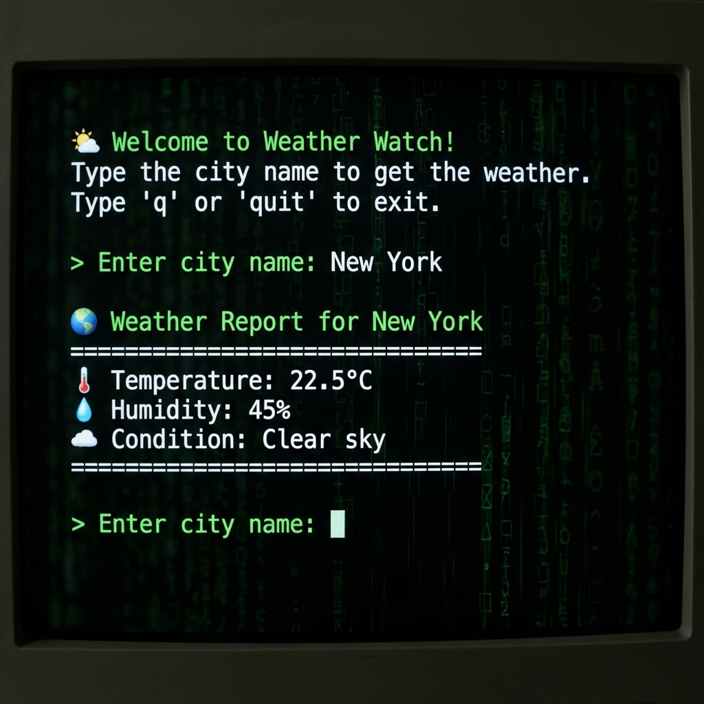

# Weather Watch 🌤️



I built this simple tool because I wanted a quick way to check the weather right from my terminal without opening a browser. It connects to the OpenWeatherMap API to get real-time data.

Just run the script, type in a city, and it tells you the temperature and conditions (so you know if you need a jacket!).

## How It Works
It's a straightforward Python script. I used the `requests` library to send a message to OpenWeatherMap's servers, which send back the weather data in JSON format. My code then parses that data and prints out the important parts nicely.

## Setup
1.  **Get an API Key**: You'll need a free key from [OpenWeatherMap](https://openweathermap.org/).
2.  **Clone the Repo**:
    ```bash
    git clone https://github.com/Parshant76/Weather_Watch.git
    cd Weather_Watch
    ```
3.  **Install Requirements**:
    ```bash
    pip install -r requirements.txt
    ```
4.  **Config**: Open `config.py` and paste your API key there.

## Running It
```bash
python main.py
```
Then just follow the prompts!

## Example Output
```text
🌤️  Welcome to Weather Watch!
Type the city name to get the weather.

> Enter city name: London

🌍 Weather Report for London
==============================
🌡️  Temperature: 15.32°C
💧 Humidity:    72%
☁️  Condition:   Scattered clouds
==============================
```

## MLH Global Week
This project was built for MLH Global Week to demonstrate API usage in Python!
